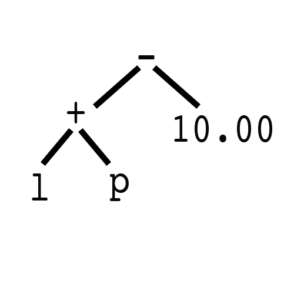

<h1>Design Patterns in Swift: Interpreter</h1>
This repository is part of a series. For the full list check out <a href="https://shirazian.wordpress.com/2016/04/11/design-patterns-in-swift/">Design Patterns in Swift</a>


<h3>The problem:</h3>
Our customers at <a href="http://www.yourmechanic.com">YourMechanic</a>  request quotes through our website or through their YourMechanic App. The final price for a quote is a combination of two variables, the cost of parts and the cost of labor. We want the ability to apply specific adjustments to either parts or labor prices. These adjustments could come from coupons, warranty claims or contests. We need a simple language that can express these custom adjustments. For example, we should be able to define an expression that can add a 20% discount for parts. Or a another code that reduces $10 on labor.  Or one that does both.

<h3>The solution:</h3>

We will define a simple language for adjustments. We will have a set of rules that will cover addition, subtraction, multiplication and division. We will also define two variables that our language will map for parts and labor prices. Once the language is defined, our users can express adjustments through a string that abides by our grammar. For example, to subtract $10 dollars from parts we would use:

```swift
var expression = "l + p - 10.00"
//adjustment: total price is labor + partsPrice - $10
```

Link to the repo for the completed project: <a href="https://github.com/kingreza/Swift-Interpreter">Swift - Interpreter</a>

<!--more-->

Before we begin, let's understand what we need to build. To be able to parse a string and interpret it as a mathematical function, we need to define a set of rules and objects. By looking at our problem a few items pop out: 

* Numbers: like $10 or 15%
* Variables: placeholders for cost of labor and parts
* Operations: +, -, * or / that will define the operation between numbers and or variables.

Although these objects have their own meaning and interpenetration, they share one important property. They are expressions that need to be interpreted by our language. Therefore we begin by defining a protocol. A protocol that will be implemented by all our expressions 

```swift
protocol Expression {
  func interpret(variables: [String:Expression]) -> Double
}
```
This protocol has one function called interpret. It will take a dictionary of expressions and returns a double. We will explain why there is a variables dictionary in a bit but the rest of the protocol should make sense. As mentioned earlier every expression will need a function to interpret it. The final value we expect to get from our expression is a double. For our atomic objects like numbers and variables, this will be their raw values. For composite expressions like addition and subtraction, this will be the result of the operation. 

This might seem a bit counter intuitive right now, but as we define our expressions it will become more clear. Lets begin by defining our number expressions:

```Swift
class Number: Expression {
  var value: Double

  init(value: Double) {
    self.value = value
  }

  func interpret(variables: [String : Expression]) -> Double {
    return value
  }
}

```

Our Number expression is a simple class that implements the Expression protocol. It has a value property of type double. This will be the value of the number represented by the number expression. We have a simple initializer that sets that value. We also have our interpret function that makes our number class conform to the Expression protocol. Interpreting a number is rather simple. It's the number itself. Our language will treat "12" as 12 and "0.14" as 0.14. Our Interpret function will return the number itself.

Lets make things a bit more interesting. Numbers on their own don't really help us that much. We need a way to be able to add, subtract, multiply and divide them. These actions can also be defined as Expressions. Lets look at what we have for addition

```swift
class Add: Expression {

  var leftOperand: Expression
  var rightOperand: Expression

  init(leftOperand: Expression, rightOperand: Expression) {
    self.leftOperand = leftOperand
    self.rightOperand = rightOperand
  }

  func interpret(variables: [String : Expression]) -> Double {
    return leftOperand.interpret(variables) + rightOperand.interpret(variables)
  }
}
```

Unlike numbers, addition is a composite expression. This makes sense since in addition we need two expression to apply the add operation. So here is how we define our Add class. Much like our number class our Add class will implement the Expression protocol. However unlike our number class Add will have two expressions instead of a double as its internal values. We will define a leftOperand and a rightOperand which will be two other expressions. Now these expressions can be Numbers or other Add expressions. But since they implement the Expression protocol, their interpreter function will give us a double. And we know how to add two doubles. In fact that will be the definition of our Add class interpret class. It will be the interpretation value of its left operand added to the interpretation of its right operands. Addition of a double with another double is a double. We will return that value as the interpreted value of our Add expression.

We can follow the same pattern for subtraction, multiplication and division. We simply change our interpret function on each class to reflect the required operation.

```Swift
class Subtract: Expression {

  var leftOperand: Expression
  var rightOperand: Expression

  init(leftOperand: Expression, rightOperand: Expression) {
    self.leftOperand = leftOperand
    self.rightOperand = rightOperand
  }

  func interpret(variables: [String : Expression]) -> Double {
    return leftOperand.interpret(variables) - rightOperand.interpret(variables)
  }
}

class Multiply: Expression {

  var leftOperand: Expression
  var rightOperand: Expression

  init(leftOperand: Expression, rightOperand: Expression) {
    self.leftOperand = leftOperand
    self.rightOperand = rightOperand
  }

  func interpret(variables: [String : Expression]) -> Double {
    return leftOperand.interpret(variables) * rightOperand.interpret(variables)
  }
}

class Divide: Expression {

  var leftOperand: Expression
  var rightOperand: Expression

  init(leftOperand: Expression, rightOperand: Expression) {
    self.leftOperand = leftOperand
    self.rightOperand = rightOperand
  }

  func interpret(variables: [String : Expression]) -> Double {
    return leftOperand.interpret(variables) / rightOperand.interpret(variables)
  }
}
```
One thing remains unanswered. Why are we passing a variable dictionary through our expressions, yet none of our defined expressions have used it so far. As mentioned earlier we need a way represent the value associated with price of parts and price of labors. These values will be stored in a variables dictionary. Each one of them will map to a defined variable in our expression. For example, lets look at the expression we mentioned earlier

```swift
var expression = "l + p - 10.00"
```

We see five expressions:
1. A variable expression that hold the value of labor costs "l"
2. An addition expression which will add the labor variable expression to the parts variable expression
3. A variable expression that will hold the value of parts cost "p"
4. A subtract expression which will subtract the number expression on the right from the result of the add expression on the left
5. A number expression which will hold the value 10.00

Our language needs a way to map these variables (l and p) to their respective values. This is where we use our variables dictionary. Lets define our last expression.

```Swift
class Variable: Expression {
  private var name: String

  init(name: String) {
    self.name = name
  }

  func interpret(variables: [String : Expression]) -> Double {
    if let expression = variables[name] {
      return expression.interpret(variables)
    } else {
      return 0.00
    }
  }
}
```

Our variable expression is a string (either 'l' for labor or 'p' for parts) that needs to map to a value. Since we have our variables dictionary in our interpret function we can look up its expression and return its interpretation. If there are no values defined for that variable we will return zero.

We have now defined our language. There are two atomic expressions: numbers and variables. We also have four composite expressions that handle addition, subtraction, multiplication and division. 

Our work is not over yet. It's one thing to be able to define a language and set its grammar. But it's useless if we don't have any means of parsing it and applying its result to our quotes. 

Lets define one last expression. We will call it the evaluator. This expression will take in a string and will parse it according to the rules we set for our language. It's going to get a bit complicated from here on so we're going to break this down and approach it step by step. 

```swift
class Evaluator: Expression {
  var syntaxTree: Expression = Number(value: 0.00)
  var expression: String

  init (expression: String) {
    self.expression = expression
  }

```

Our evaluator expression, much like addition and subtraction, is a composition of one or more expressions. We first define a root expression called syntaxTree. We will set this expression to be equal to a Number expression with a value zero by default. We also define a expression property of type string which will be the string input, defining our expression. Why do we call our original expression 'syntaxTree'? If we look at our sample expression from the beginning we see that it breaks down into a tree:

```swift
var expression = "l + p - 10.00"
```

If we move from left to right and parse our expression one item at a item we should end up with the following tree:


Once we have this tree, calling interpret on our root expression (- in this case) will return the value we seek. If you are unsure on why that is the case, I recommend going over our expression definitions.

How do we build this tree? 

```swift 
 import Foundation
 private func buildSyntaxTree() {
    var expressionStack = Stack<Expression>()

    var items = expression.componentsSeparatedByString(" ")

    var index = 0

    while index < items.count {

      switch items[index] {
      case "*":
        let nextExpression = getNextExpression(items, index: index)
        expressionStack.push(Multiply(leftOperand: expressionStack.pop(),
          rightOperand: nextExpression))
        index += 2
      case "/":
        let nextExpression = getNextExpression(items, index: index)
        expressionStack.push(Divide(leftOperand: expressionStack.pop(),
          rightOperand: nextExpression))
        index += 2
      case "+":
        let nextExpression = getNextExpression(items, index: index)
        expressionStack.push(Add(leftOperand: expressionStack.pop(),
          rightOperand: nextExpression))
        index += 2

      case "-":
        let nextExpression = getNextExpression(items, index: index)
        expressionStack.push(Subtract(leftOperand: expressionStack.pop(),
          rightOperand: nextExpression))
        index += 2

      default:
        if let doubleValue = items[index].doubleValue {
          expressionStack.push(Number(value: doubleValue))
          index += 1
        } else {
          expressionStack.push(Variable(name: items[index]))
          index += 1
        }
      }

    }
    syntaxTree = expressionStack.pop()
  }

  private func getNextExpression(items: [String], index: Int) -> Expression {
    let next = items[index + 1]
    var nextExpression: Expression
    if let doubleValue = next.doubleValue {
      nextExpression = Number(value: doubleValue)
    } else {
      nextExpression = Variable(name: next)
    }
    return nextExpression
  }
 ```
 
 We first start by declaring a Stack of type expression. If you copy past this code into your project as is, Swift compiler will complain "Use of unresolved identifier 'Stack'. That's because Swift currently does not ship with a generic Stack data structure. If you are unfamiliar with Stacks, [please review this](https://en.wikibooks.org/wiki/Data_Structures/Stacks_and_Queues). 
 
Lucky for us, building a generic Stack data structure is rather trivial in Swift. I don't want to get too far into it but feel free to research it if you wish. Here is the code that provides us with a simple Stack.

```Swift
struct Stack<T> {

  var items = [T]()

  mutating func push(item: T) {
    items.append(item)
  }

  mutating func pop() -> T {
    return items.removeLast()
  }
}

```

Next we split our string expression by spaces. Our expression is now  `["l", "+", "p", "-", "10.00"]`. Make sure you have `import Foundation` at the beginning of the class definition.
Next we loop through our items in our now separated expression array and deal with each case by case. We define a switch statement, that on operation expressions like '+' and '-' where we need the expression before and the one after does the following:
* We grab the left operand by popping the stack which would hold the last value we processed. 
* We grab the right operand by processing the next item using the `getNextExpression` and setting the index to account for the move.

It is important to note that we assume that our expression text is valid. That between every operation expression is either a number or variable expression. This makes sense since something like "12 + 5 - +" or "12 5" doesn't mean anything in our language definition. There are no specific error checks in place right now and we can leave that as an exercise. For our case, we assume the input expression is valid. 

At then end we assign the last item we processed in our stack to our syntax tree. The last item in our stack will be the root of our syntax tree. Now that we have our syntax tree it seems like we are done. We can pass our tree to our interpret function and have it calculate the final value for our quote price. 

Not so fast...

We have a problem. If you remember from grade school, order of operations dictates we calculate multiplications and divisions before addition and subtraction. Right now our tree will process from left to right. If our expression has only addition and subtraction or only multiplication and division, it will work correctly. However for the following expression:

```swift
var expression = "5.00 + 10.00 * 2.0"
```

Our evaluator will return 30.00. This is incorrect, we know that answer is 25.00. How do we deal with order of operations? How do we get our evaluator to process multiplication and division before addition and subtraction. My favorite approach is to split our expressions on '+' and '-' first. For the example, the above expression would be broken down into "5.00" and "10.00 * 2.0". The sub expressions will be of the same operation order and can be calculated from left to right. We will then end up with "5.00" and "20.00", which we can merge back and end up with "5.00 + 20.00". We can now process this expression and end up with the correct answer: 25.00

Let's see how this done:

```Swift
 func interpret(variables: [String : Expression]) -> Double {

    if (expression.contains("/") || expression.contains("*")) &&
       (expression.contains("+") || expression.contains("-")) {

      let expressions = parseoutAdditionsAndSubtractions(expression)
      var newExpression = ""
      var index = 0
      for expression in expressions {
        if expression == "+" || expression == "-" {
          newExpression += expression
        } else {
          let eval = Evaluator(expression: expression)
          let result = eval.interpret(variables)
          newExpression += String(result)
        }

        if index != expressions.count - 1 {
          newExpression += " "
        }
        index += 1
      }
      let evaluator = Evaluator(expression: newExpression)
      return evaluator.interpret(variables)
    } else {
      buildSyntaxTree()
      return syntaxTree.interpret(variables)
    }
  }
  
  private func parseoutAdditionsAndSubtractions(input: String) -> [String] {
    var result = [String]()

    let items = input.componentsSeparatedByString(" ")

    var sentence = ""
    var index = 0
    for item in items {
      if item == "+" || item == "-" {
        result.append(sentence.trim())
        result.append(item)
        sentence = ""
      } else {
        sentence += item
        if index != items.count - 1 {
          sentence += " "
        }
      }
      index += 1
    }
    result.append(sentence)
    return result
  }
}
```
We define our interpret function by first checking to see if we need to worry about order of operations. If our expression has "+" or "-" and "\*" or "/" then we have to ensure correct order of operations.  We start by parsing out addition and subtraction elements. Our function `parseoutAdditionsAndSubtractions` will return ["5.00", "+", "10.00 \* 2.0"] for "5.00 + 10.00 * 2.0"

We then go through each item, if it's '+' or '-' we will concatenate it to our newExpression. Otherwise we evalute its value and concatenate it to our new expression. Once our newExpression is built, in this case it will be "5.00 + 20.00" we will evaluate it and return it. 

If our expression doesn't need to worry about order of operations. We will just build our syntaxTree and interpret it.

This class can be a little overwhelming. I suggest downloading the repo and stepping through a few examples to get a good feel for how it works. 

So now that we have our language defined, our expressions fleshed out and a working evaluator in place lets see it in action. 

First lets define our Quote class. 


```Swift
import Foundation

class Quote {

  var partsPrice: Double
  var laborPrice: Double
  var adjustments: String?

  init(partsPrice: Double, laborPrice: Double, adjustments: String?) {
    self.partsPrice = partsPrice
    self.laborPrice = laborPrice
    self.adjustments = adjustments
  }

  convenience init(partsPrice: Double, laborPrice: Double) {
    self.init(partsPrice: partsPrice, laborPrice: laborPrice, adjustments: nil)
  }

  var totalPrice: Double {
    if let adjustments = adjustments {
      var variables = [String: Expression] ()
      variables["l"] = Number(value: laborPrice)
      variables["p"] = Number(value: partsPrice)
      let evaluator = Evaluator(expression: adjustments)
      return evaluator.interpret(variables)
    } else {
      return partsPrice + laborPrice
    }
  }
}
```

Our Quote class will have three properties. One for price on parts, another for price on labor and at last a string that will conform to our language and sets the total price called adjustments. We initialize these properties in our initilizer. 

We will define our totalPrice property as a computed property. If we have an adjustment we will create our variable dictionary. We will assign the labor price as a number expression to 'l' and the parts prices to 'p'. We will create an evaluator expression using the adjustment string and return its interpreted value by passing our dictionary into it. 

If we do not have an adjustment defined for our quote, we will return parts price + labor price as expected. 

Let's test some cases:

```Swift
import Foundation

var quote = Quote(partsPrice: 145.00, laborPrice: 45.00)

//adjustment: total price is only labor plus $20
quote.adjustments = "l + 20.00"
print(quote.totalPrice)

//adjustment: total price is partsPrice - $10
quote.adjustments = "p - 10.00"
print(quote.totalPrice)

//adjustment: total price is labor and part - $10
quote.adjustments = "l + p - 10.00"
print(quote.totalPrice)

//adjustment: total price is labor + 10% off parts
quote.adjustments = "l + p - p * 0.1"
print(quote.totalPrice)

//adjustment: total price is 20% off labor + 10% off parts
quote.adjustments = "l - l * 0.2 + p - p * 0.1"
print(quote.totalPrice)

//adjustment: total price is %20 off total price
quote.adjustments = "l - l * 0.2 + p - p * 0.2"
print(quote.totalPrice)

//adjustment total price is parts * labor :|
quote.adjustments = "p * l"
print(quote.totalPrice)
```
 
Running these will return the following

```
65.0
135.0
180.0
175.5
166.5
152.0
6525.0
```

We see that our language definition is working as expected. We see that our evaluator parses our adjustment string correctly and the correct value is calculated. We also see that order of operation is honored and that we can now define complex adjustment for our quote object with ease. 

Congratulations you have just implemented the Interpreter Design Pattern to solve a nontrivial problem.

The repo for the complete project can be found here: <a href="https://github.com/kingreza/Swift-Interpreter">Swift - Interpreter.</a>

Download a copy of it and play around with it. See if you can find ways to improve its design, Add more complex functionalities. Here are some suggestions on how to expand or improve on the project:

* A new price for cost of gas needs to be added to the total price. Define a variable 'g' for this cost in our language.
* We assume our adjustment input is correct, add descriptive error checking for our parser.
* The process used for honoring order of operations in this solution is simple but not efficient. How can we improve on it?
* Add parenthesis to our language  


We also defined a few extension in this project that I didn't explain in details because I felt it distracted from an already complicated explanation of the interpreter design pattern. They are included in the repo but if you're reading the code and you see calls to functions that you haven't seen before they are most likely defined as an extension. Here they are:

```swift
extension String {
  struct NumberFormatter {
    static let instance = NSNumberFormatter()
  }

  var doubleValue: Double? {
    return NumberFormatter.instance.numberFromString(self)?.doubleValue
  }

  var integerValue: Int? {
    return NumberFormatter.instance.numberFromString(self)?.integerValue
  }

  func contains(find: String) -> Bool {
    return self.rangeOfString(find) != nil
  }

  func trim() -> String {
    return self.stringByTrimmingCharactersInSet(NSCharacterSet.whitespaceCharacterSet())
  }
}
swift
